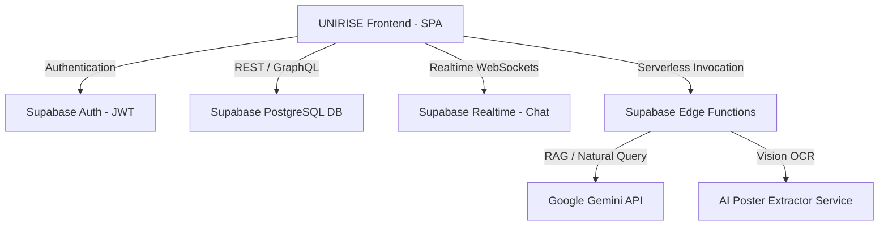

# UNIRISE Backend System Architecture & Security Specification

## 1. High-Level Architecture Overview

UNIRISE utilizes a decoupled architecture where the pure HTML/CSS/JS frontend connects to Supabase PostgreSQL and Edge Functions via async client service modules.

---

## 2. Core Entities & Database Schema

The database model is structured around 12 core PostgreSQL tables with strict foreign key constraints:

| Entity | Primary Key | Description | Relationships |
| :--- | :--- | :--- | :--- |
| `profiles` | `id` (UUID) | User accounts (students, coordinators, admins) | References `auth.users(id)` |
| `clubs` | `id` (UUID) | Verified campus organizations | `leader_id` ➔ `profiles.id` |
| `club_members` | `id` (UUID) | Club membership tracking | Junction `clubs` ↔ `profiles` |
| `club_positions` | `id` (UUID) | Transferable official identities (President, Vice President, etc.) | Junction `clubs` ↔ `profiles` |
| `posts` | `id` (UUID) | Campus feed opportunities (events, hackathons, internships) | `author_id` ➔ `profiles.id`, `club_id` ➔ `clubs.id` |
| `events` | `id` (UUID) | Detailed event metadata | `post_id` ➔ `posts.id` |
| `event_registrations` | `id` (UUID) | Student registrations for campus events | Junction `events` ↔ `profiles` |
| `connections` | `id` (UUID) | Mentor and teammate networking | Junction `requester_id` ↔ `addressee_id` |
| `conversations` | `id` (UUID) | Chat channels (Open Campus, Groups, Personal) | Multi-user chat container |
| `conversation_members` | `id` (UUID) | Chat channel participants | Junction `conversations` ↔ `profiles` |
| `messages` | `id` (UUID) | Individual chat messages | `conversation_id` ➔ `conversations.id` |
| `notifications` | `id` (UUID) | Targeted user notifications | `recipient_id` ➔ `profiles.id` |

---

## 3. Role-Based Access Control (RBAC) & Row Level Security (RLS)

### Roles
1. `student`: Default campus user. Can browse feed, apply for events, join clubs, connect with mentors/teammates, and use UNIRISE AI.
2. `club_coordinator`: Verified club officer. Can publish official club announcements, extract posters, manage members, and hold club positions.
3. `college_admin`: Campus administrator. Can verify clubs, assign coordinator roles, and transfer official positions.

### RLS Policies
* **Public Reads**: `profiles`, `clubs`, `posts`, `events`, `conversations`, and `messages` are readable by authenticated campus users.
* **Protected Writes**: Users can only update their own `profiles` (`auth.uid() = id`).
* **Author Writes**: Only post authors or club position holders can modify or delete posts (`auth.uid() = author_id`).
* **Private Reads**: Notifications and connection requests are strictly restricted to intended recipients (`auth.uid() = recipient_id`).

---

## 4. AI Assistant Edge Function Gateway

The UNIRISE AI Assistant interface communicates through serverless Edge Functions:

1. **`ai-assistant` Edge Function**: Receives natural language queries, performs keyword / vector retrieval against `posts` and `clubs`, and formats structured response cards.
2. **`poster-ocr` Edge Function**: Accepts poster images, processes OCR vision metadata, and extracts title, date, venue, registration links, and description.
3. **`position-transfer` Edge Function**: Executes atomic transfer of club leadership positions (`club_positions`) between verified members with administrator audit logs.
